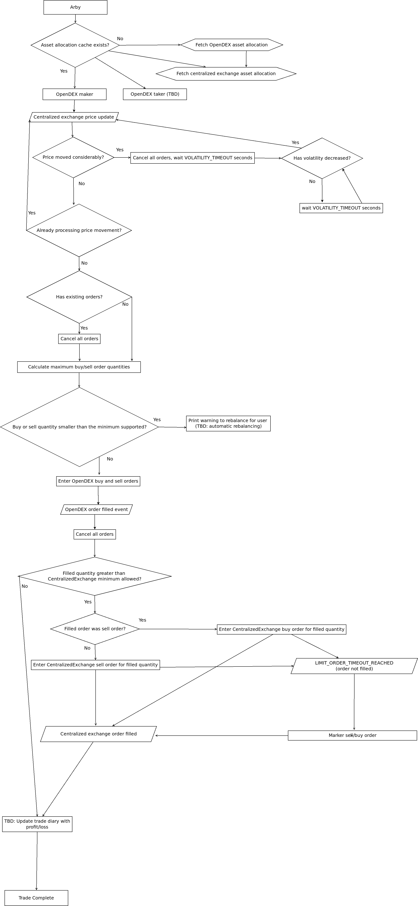

# Arby
Arby looks for arbitrage opportunities on the OpenDEX network. Once a profitable trade appears it will automatically attempt to enter it. It will also enter active orders to the orderbook and updates them every 1 minute by default.

Currently, it is possible to use Arby for arbitrage trades between OpenDEX and Binance for LTCBTC trading pair. The system is designed in a way that allows more exchanges and trading pairs to be added in the future.

[Setup Guide](./setup.md)

## How does it work?
Below you'll find a flowchart that attempts to describe Arby's logic in as much as detail as possible:

### Price and quantity
All price calculations are rounded to 8 decimal points.

#### OpenDEX buy price
Buy price is calculated using:
- current spot price P(s)
- margin config M

`BUY_PRICE = ROUND[P(s) - P(s) * M, 8]`

#### OpenDEX sell price
Sell price is calculated using:
- current spot price P(s)
- margin config M

`SELL_PRICE = ROUND[P(s) + P(s) * M, 8]`

#### Buy quantity
Buy quantity is calcualated using:
- current spot price P(s)
- centralized exchange's quote asset balance C(q)
- OpenDEX's quote asset max buy O(q)
- minimimum order size for centralized exchange C(m)

`BUY_QUANTITY = ROUND[MIN[O(q), C(q)] / P(s), 8]`

`BUY_QUANTITY` must be greater than C(m)

#### Sell quantity
Sell quantity is calcualated using:
- centralized exchange's base asset balance C(b)
- OpenDEX's base asset max sell O(b)
- minimimum order size for centralized exchange C(m)

`SELL_QUANTITY = ROUND[MIN[O(b), C(b)], 8]`

`SELL_QUANTITY` must be greater than C(m)
